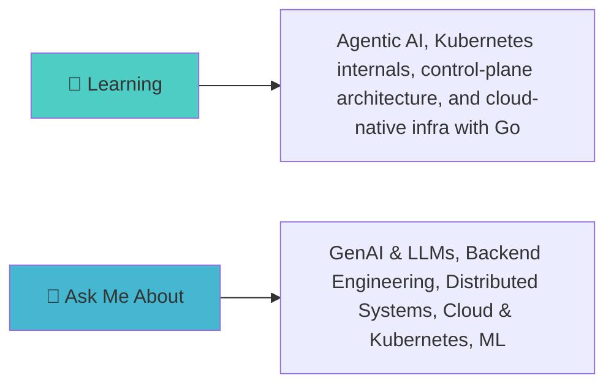

<div align="center">

<!-- Animated Header -->


<!-- Typing Animation -->


</div>

---

<div align="center">

## 🎯 WHO AM I?

<table>
<tr>
<td>

</td>
<td>

```yaml
name: Naitik Rishu
located_in: Ghaziabad, Uttar Pradesh

currently_learning: >
  Exploring Agentic AI, while diving deeper into Kubernetes internals,
  control-plane architecture, and cloud-native infrastructure — with
  Go as my main language for systems-level development.
```

</td>
</tr>
</table>

</div>

---

<div align="center">

## 🚀 TECH STACK & TOOLS

[](https://skillicons.dev)

<br/><br/>

<!-- Programming Languages -->
 **Languages I Speak:**


</div>

---

<div align="center">

## 📊 GITHUB ANALYTICS


<br/>


</div>

---

<div align="center">

## 🏆 ACHIEVEMENTS & TROPHIES


</div>

---

<div align="center">

## 🎯 CURRENT FOCUS




</div>

---

<div align="center">

## 📈 CONTRIBUTION GRAPH


</div>

---

<div align="center">

## 🌐 CONNECT WITH ME


[](mailto:naitik.2111.nr@gmail.com)

### 💬 Let's Talk About:
- 🔥 Web Development & Modern Frameworks
- 🤖 AI/ML & Data Science
- 🎨 UI/UX Design Principles
- 🚀 Startup Ideas & Innovation
- 📚 Tech Books & Learning Resources

</div>

---

<div align="center">

## 📊 WEEKLY DEVELOPMENT BREAKDOWN

<!--START_SECTION:waka-->
<!--END_SECTION:waka-->

</div>

---

<div align="center">


### Thanks for visiting! Have a great day! ✨


</div>
